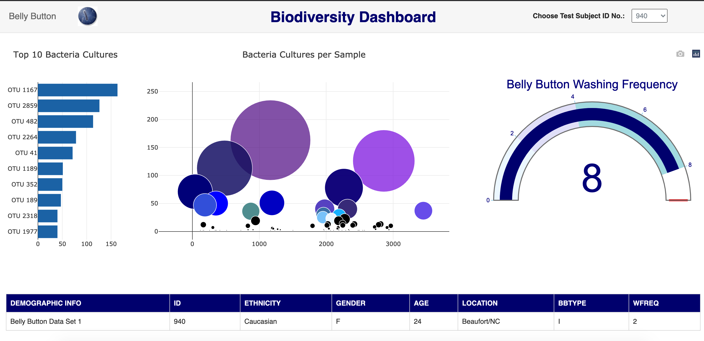

# plotly-challenge
* Build an interactive dashboard to explore the Belly Button Biodiversity Dataset

The belly button is one of the habitats closest to us, and yet it remains relatively unexplored. In January 2011, we launched Belly Button Biodiversity to investigate the microbes inhabiting our navels and the factors that might influence the microscopic life calling this protected, moist patch of skin home. In addition to inspiring scientific curiosity, Belly Button Biodiversity inspired conversations about the beneficial roles microbes play in our daily lives.


[](http://commonmark.org)
[](http://hits.dwyl.com/OlegRyzhkov2020/plotly-challenge)


## Main Dashboard



## Dataset Exploring

```JavaScript
//------------------------------------------------------------------------------
//Create Selection ID list
//------------------------------------------------------------------------------
function initDropdownList( id, data ) {
    var select, i, option;
    select = document.getElementById( id );
    for ( i in data ) {
        option = document.createElement( 'option' );
        option.value = option.text = data[i]['id'];
        select.add( option );
    }
};

```
## Plotly Library (trusted framework for building ML & data science web apps)

```JavaScript
//------------------------------------------------------------------------------
//Gauge Chart
//------------------------------------------------------------------------------
let speed_value = data_values.length/100*10;
var gauge_data = [
{
  type: "indicator",
  mode: "gauge+number",
  value: speed_value,
  title: { text: "Belly Button Washing Frequency", font: { size: 24 } },
  gauge: {
    axis: { range: [null, 9], tickwidth: 1, tickcolor: "skyblue" },
    bar: { color: "navy" },
    bgcolor: "white",
    borderwidth: 2,
    bordercolor: "gray",
    steps: [
      { range: [0, 2], color: "aliceblue" },
      { range: [2, 4], color: "lavender" },
      { range: [4, 8], color: "powderblue" }
    ],
    threshold: {
      line: { color: "red", width: 4 },
      thickness: 0.75,
      value: 9
    }
    }
  }
];

var gauge_layout = {
  width: 450,
  height: 420,
  margin: { t: 25, r: 25, l: 25, b: 25 },
  paper_bgcolor: "white",
  font: { color: "darkblue", family: "Arial" }
};

Plotly.newPlot('gauge', gauge_data, gauge_layout);

};
```
## Contacts
[Find Me on
LinkedIn](https://www.linkedin.com/in/oleg-n-ryzhkov/)
